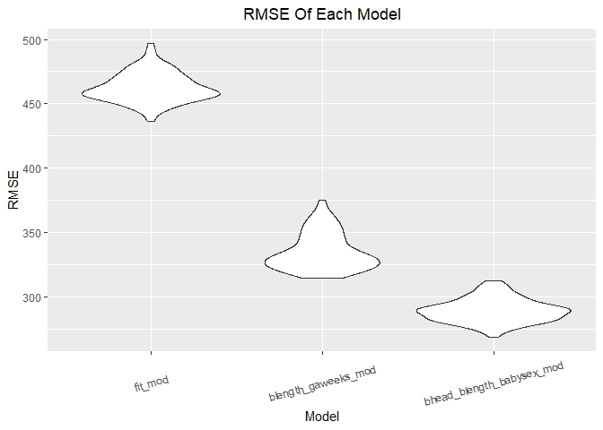

p8105_hw6_bf2506
================
bf2506
2022-11-30

``` r
library(tidyverse)
library(modelr)
```

### Problem 2

``` r
homi_data = 
  read.csv("./data/homicide-data.csv") %>%
  janitor::clean_names()
```

Create a city_state variable, and a binary resolved variable of
disposition. Omit cities Dallas, TX; Phoenix, AZ; and Kansas City, MO –
these don’t report victim race. Also omit Tulsa, AL – this is a data
entry mistake. For this problem, limit your analysis those for whom
victim_race is white or black. Be sure that victim_age is numeric.

``` r
homi_data = 
  homi_data %>% 
  mutate(city_state = paste(city, state, sep = ", ", collapse = NULL)) %>% 
  mutate(resolved = as.numeric(disposition == "Closed by arrest"),
         victim_age = as.numeric(victim_age)) %>%
  relocate(city_state) %>% 
  filter( !(city_state %in% c("Dallas, TX", "Phoenix, AZ", " Kansas City, MO", "Tulsa, AL")),
    victim_race %in% c("Black", "White")) %>% 
  mutate(
    victim_race = as.factor(victim_race),
    victim_sex = as.factor(victim_sex))
```

    ## Warning in mask$eval_all_mutate(quo): 强制改变过程中产生了NA

**” Closed by arrest” in disposition is represented as 1 in resolved
variable, which means cases are resolved. “Closed without arrest” and
“Open/No arrest” in disposition are represented as 0 in resolved
variable, which means cases are not resolved.**

For the city of Baltimore, MD, use the glm function to fit a logistic
regression with resolved vs unresolved as the outcome and victim age,
sex and race as predictors. Save the output of glm as an R object.

``` r
baltimore_df =
  homi_data %>%
  filter(city_state == "Baltimore, MD")

fit_logistic_balt = 
  glm(resolved ~ victim_age + victim_sex + victim_race, family = binomial(), data = baltimore_df) 
```

Apply the broom::tidy to this object; and obtain the estimate and
confidence interval of the adjusted odds ratio for solving homicides
comparing male victims to female victims keeping all other variables
fixed.

``` r
fit_balt_table = fit_logistic_balt %>% broom::tidy() 

sexMale_balt = 
  fit_balt_table %>% 
  filter(term == "victim_sexMale") %>% 
  mutate(
    OR = exp(estimate),
    conf_lower = exp(estimate - 1.96*std.error),
    conf_upper = exp(estimate + 1.96*std.error))

sexMale_balt
```

    ## # A tibble: 1 × 8
    ##   term           estimate std.error statistic  p.value    OR conf_lower conf_u…¹
    ##   <chr>             <dbl>     <dbl>     <dbl>    <dbl> <dbl>      <dbl>    <dbl>
    ## 1 victim_sexMale   -0.854     0.138     -6.18 6.26e-10 0.426      0.325    0.558
    ## # … with abbreviated variable name ¹​conf_upper

- The estimate value of the adjusted odds ratio is 0.4255117
- The corresponding 95% confidence interval is (0.324559, 0.5578655)

Run glm for each of the cities in your dataset, and extract the adjusted
odds ratio (and CI) for solving homicides comparing male victims to
female victims.

``` r
func = function(everycity_df) {
  
  fit_everycity = 
    glm(resolved ~ victim_age + victim_sex + victim_race, family = binomial(), data = everycity_df) %>%
    broom::tidy() %>% 
    mutate(
    OR = exp(estimate),
    conf_lower = exp(estimate - 1.96*std.error),
    conf_upper = exp(estimate + 1.96*std.error)) %>%
    filter(term == "victim_sexMale") %>%
    select(OR, conf_lower, conf_upper)
  
  return(fit_everycity)
}
```

``` r
everycity_df = 
  homi_data %>%
  nest(data = uid:resolved) %>%
  mutate(
    outputs = map(data, func)) %>%
  select(-data) %>%
  unnest(outputs)

everycity_df %>%
  knitr::kable(digits = 3)
```

| city_state         |    OR | conf_lower | conf_upper |
|:-------------------|------:|-----------:|-----------:|
| Albuquerque, NM    | 1.767 |      0.831 |      3.761 |
| Atlanta, GA        | 1.000 |      0.684 |      1.463 |
| Baltimore, MD      | 0.426 |      0.325 |      0.558 |
| Baton Rouge, LA    | 0.381 |      0.209 |      0.695 |
| Birmingham, AL     | 0.870 |      0.574 |      1.318 |
| Boston, MA         | 0.674 |      0.356 |      1.276 |
| Buffalo, NY        | 0.521 |      0.290 |      0.935 |
| Charlotte, NC      | 0.884 |      0.557 |      1.403 |
| Chicago, IL        | 0.410 |      0.336 |      0.501 |
| Cincinnati, OH     | 0.400 |      0.236 |      0.677 |
| Columbus, OH       | 0.532 |      0.378 |      0.750 |
| Denver, CO         | 0.479 |      0.236 |      0.971 |
| Detroit, MI        | 0.582 |      0.462 |      0.734 |
| Durham, NC         | 0.812 |      0.392 |      1.683 |
| Fort Worth, TX     | 0.669 |      0.397 |      1.127 |
| Fresno, CA         | 1.335 |      0.580 |      3.071 |
| Houston, TX        | 0.711 |      0.558 |      0.907 |
| Indianapolis, IN   | 0.919 |      0.679 |      1.242 |
| Jacksonville, FL   | 0.720 |      0.537 |      0.966 |
| Las Vegas, NV      | 0.837 |      0.608 |      1.154 |
| Long Beach, CA     | 0.410 |      0.156 |      1.082 |
| Los Angeles, CA    | 0.662 |      0.458 |      0.956 |
| Louisville, KY     | 0.491 |      0.305 |      0.790 |
| Memphis, TN        | 0.723 |      0.529 |      0.988 |
| Miami, FL          | 0.515 |      0.304 |      0.872 |
| Milwaukee, wI      | 0.727 |      0.499 |      1.060 |
| Minneapolis, MN    | 0.947 |      0.478 |      1.875 |
| Nashville, TN      | 1.034 |      0.685 |      1.562 |
| New Orleans, LA    | 0.585 |      0.422 |      0.811 |
| New York, NY       | 0.262 |      0.138 |      0.499 |
| Oakland, CA        | 0.563 |      0.365 |      0.868 |
| Oklahoma City, OK  | 0.974 |      0.624 |      1.520 |
| Omaha, NE          | 0.382 |      0.203 |      0.721 |
| Philadelphia, PA   | 0.496 |      0.378 |      0.652 |
| Pittsburgh, PA     | 0.431 |      0.265 |      0.700 |
| Richmond, VA       | 1.006 |      0.498 |      2.033 |
| San Antonio, TX    | 0.705 |      0.398 |      1.249 |
| Sacramento, CA     | 0.669 |      0.335 |      1.337 |
| Savannah, GA       | 0.867 |      0.422 |      1.780 |
| San Bernardino, CA | 0.500 |      0.171 |      1.462 |
| San Diego, CA      | 0.413 |      0.200 |      0.855 |
| San Francisco, CA  | 0.608 |      0.317 |      1.165 |
| St. Louis, MO      | 0.703 |      0.530 |      0.932 |
| Stockton, CA       | 1.352 |      0.621 |      2.942 |
| Tampa, FL          | 0.808 |      0.348 |      1.876 |
| Tulsa, OK          | 0.976 |      0.614 |      1.552 |
| Washington, DC     | 0.690 |      0.468 |      1.017 |

Create a plot that shows the estimated ORs and CIs for each city.
Organize cities according to estimated OR, and comment on the plot.

``` r
everycity_plot = 
  everycity_df %>% 
  mutate(city_state = fct_reorder(city_state, OR)) %>%
  ggplot(aes(x = city_state, y = OR)) +
  geom_point() +
  geom_errorbar(aes(ymin = conf_lower, ymax = conf_upper)) +
  theme(axis.text.x = element_text(angle = 90, vjust = 0.5, hjust = 0.5)) +
  labs(title = "Estimate And CIs Of Adjusted Odds Ratio Comparing Male Victims To Female", x = "City, State", y = "Estimate / CI for solving homicides")

everycity_plot
```

<!-- -->
“Comment\*\*: The adjusted odds ratio for solving homicides comparing
male victims to female victims is less than 1 in most cities in the USA
shown in this plot, which means male cases are harder to solve than
females in most America cities. Only in Nashville, TN/Fresno,
CA/Stockton, CA/Albuquerque, NM, male cases have higher odds of being
solved. It can also be noted that the odds ratio for Atlanta, GA is
equal to one, which is equally likely to be solved (Richmond, VA has an
approximated value to 1). And the odds is the lowest in New York, NY,
which means male cases are the hardest to be solved than female’s among
all the city above.

### Problem 3

Load and clean the data for regression analysis

``` r
birthweight_data = 
  read.csv("./data/birthweight.csv") %>%
  janitor::clean_names() %>% 
  drop_na() %>% 
  mutate(babysex = as.factor(babysex),
         frace = as.factor(frace),
         malform = as.factor(malform),
         mrace = as.factor(mrace))
```

Propose a regression model for birthweight. I propose my regression
model mainly by a hypothesized structure. I google “Factors influencing
fetal birth weight” then find it is relative to genetics, Ethnicity, Age
of the parent, Number of babies, Length of Pregnancy, Mother’s birth
weight, Diet during pregnancy, Mother’s habits, Gender, and Parent’s
medical conditions, etc. SO I decide to choose these as predictors:

- Ethnicity
  - mrace: mother’s race (1 = White, 2 = Black, 3 = Asian, 4 = Puerto
    Rican, 8 = Other)
- Age of the parent
  - momage: mother’s age at delivery (years)
- Number of babies
  - parity: number of live births prior to this pregnancy
- Length of Pregnancy
  - gaweeks: gestational age in weeks
- Diet during pregnancy
  - wtgain: mother’s weight gain during pregnancy (pounds)
- Mother’s habits
  - smoken: average number of cigarettes smoked per day during pregnancy
- Gender
  - babysex: baby’s sex (male = 1, female = 2)
- Else
  - malform: presence of malformations that could affect weight (0 =
    absent, 1 = present)

Then I Fit a model

``` r
fit_test= lm(bwt ~ babysex + mrace + parity + momage + gaweeks + malform + smoken + wtgain, data = birthweight_data)

summary(fit_test)
```

    ## 
    ## Call:
    ## lm(formula = bwt ~ babysex + mrace + parity + momage + gaweeks + 
    ##     malform + smoken + wtgain, data = birthweight_data)
    ## 
    ## Residuals:
    ##      Min       1Q   Median       3Q      Max 
    ## -1660.36  -271.46    10.25   276.51  1653.58 
    ## 
    ## Coefficients:
    ##              Estimate Std. Error t value Pr(>|t|)    
    ## (Intercept)  862.5657    92.5231   9.323  < 2e-16 ***
    ## babysex2     -86.6600    13.1499  -6.590 4.92e-11 ***
    ## mrace2      -275.9966    15.0783 -18.304  < 2e-16 ***
    ## mrace3      -198.5309    67.0322  -2.962  0.00308 ** 
    ## mrace4      -168.4294    29.6211  -5.686 1.38e-08 ***
    ## parity        91.2400    64.0554   1.424  0.15441    
    ## momage         4.6543     1.8353   2.536  0.01125 *  
    ## gaweeks       55.1638     2.1524  25.629  < 2e-16 ***
    ## malform1     -56.7879   111.8218  -0.508  0.61159    
    ## smoken       -11.3392     0.9160 -12.380  < 2e-16 ***
    ## wtgain         9.2538     0.6105  15.159  < 2e-16 ***
    ## ---
    ## Signif. codes:  0 '***' 0.001 '**' 0.01 '*' 0.05 '.' 0.1 ' ' 1
    ## 
    ## Residual standard error: 431.7 on 4331 degrees of freedom
    ## Multiple R-squared:  0.2913, Adjusted R-squared:  0.2896 
    ## F-statistic:   178 on 10 and 4331 DF,  p-value: < 2.2e-16

*According to the above table, I removed the momage, malform and parity
variables because they are not significantly related.*

Fit my final model

``` r
fit = lm(bwt ~ babysex + mrace + gaweeks + smoken + wtgain, data = birthweight_data)
```

**Predictors**: babysex, mrace, gaweeks, smoken, wtgain

Plot of model residuals against fitted values

``` r
plot_df = 
  birthweight_data %>% 
  select(bwt, babysex, mrace, gaweeks, smoken, wtgain) %>%
  modelr::add_residuals(., fit) %>% 
  modelr::add_predictions(., fit)

plot = 
  ggplot(plot_df, aes(x = pred, y = resid)) + 
  geom_point() +
  geom_hline(yintercept = 0) +
  labs( title = "Residuals against fitted values", x = "Prediction (garms)", y = "Residuals (garms)")

plot
```

<!-- -->
*The model seems good because most values are evenly distributed on the
y=0 line (exists some outliers).*

Second part is comparing my model to two others:

- using length at birth and gestational age as predictors
- using head circumference, length, sex, and all interactions

Then make this comparison in terms of the cross-validated prediction
error; use crossv_mc and functions in purrr as appropriate.

``` r
cv_df = 
  crossv_mc(birthweight_data, 100) %>% 
  mutate(
    train = map(train, as_tibble),
    test = map(test, as_tibble))

cv_results = 
  cv_df %>% 
  mutate(
    fit_mod = map(train, ~lm(bwt ~ babysex + mrace + parity + smoken + wtgain, data = .x)),
    blength_gaweeks_mod = map(train, ~lm(bwt ~ blength + gaweeks, data = .x)),
    bhead_blength_babysex_mod = map(train, ~lm(bwt ~ bhead + blength + babysex + bhead*blength*babysex, data = .x))) %>% 
  mutate(
    rmse_fit_mod = map2_dbl(fit_mod, test, ~rmse(model = .x, data = .y)),
    rmse_blength_gaweeks_mod = map2_dbl(blength_gaweeks_mod, test, ~rmse(model = .x, data = .y)),
    rmse_bhead_blength_babysex_mod = map2_dbl(bhead_blength_babysex_mod, test, ~rmse(model = .x, data = .y)))
```

``` r
cv_plot = 
  cv_results %>% 
  select(starts_with("rmse")) %>% 
  pivot_longer(
    everything(),
    names_to = "model", 
    values_to = "rmse",
    names_prefix = "rmse_") %>% 
  mutate(model = fct_inorder(model)) %>% 
  ggplot(aes(x = model, y = rmse)) + geom_violin() +
  labs(title = "RMSE Of Each Model", x = "Model", y = "RMSE") +
  theme(axis.text.x = element_text(angle = 15, vjust = 0.5, hjust = 0.5))+
  theme(plot.title=element_text(hjust = 0.5))
cv_plot
```

<!-- --> According
to the plot of “RMSE Of Each Model”(cross-validation), my model has the
biggest RMSE, so mine seems the worst. And the third model (using head
circumference, length, sex, and all interactions) appears to be doing
better than the second model (using length at birth and gestational age
as predictors). It has a low RMSE.
